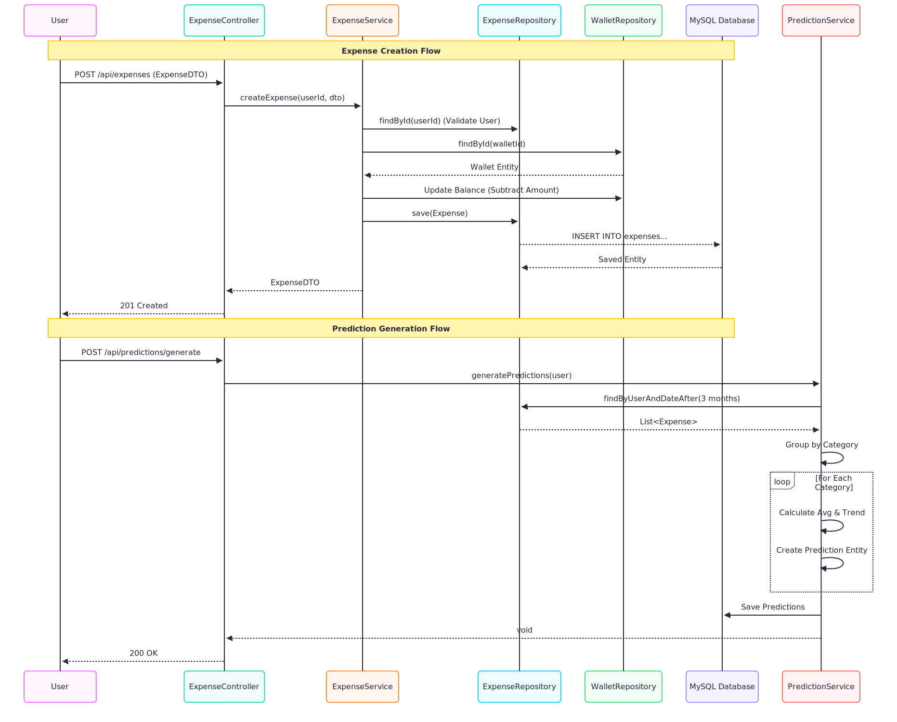

# Expense Tracker Backend

## Overview
The Expense Tracker Backend is a robust Spring Boot application designed to manage personal finances. It follows a **Modular Monolith** architecture, organizing code by features rather than layers, which improves maintainability and scalability. The application provides RESTful APIs for expense tracking, budgeting, and AI-powered financial predictions.

## Tech Stack
-   **Java 17**: Core programming language.
-   **Spring Boot 3.2.0**: Framework for building the application.
-   **Spring Data JPA**: For database interactions.
-   **MySQL**: Relational database management system.
-   **Spring Security & JWT**: For secure authentication and authorization.
-   **Lombok**: To reduce boilerplate code.
-   **SpringDoc OpenAPI**: For API documentation (Swagger UI).

## Architecture
The project is structured around **Features**. Each feature (e.g., `expense`, `prediction`, `user`) contains its own Controller, Service, Repository, and Entities.

### Directory Structure
```
com.expensetracker
├── config          # Global configurations (Security, Swagger, etc.)
├── entity          # Shared entities (User, etc.)
├── features        # Feature modules
│   ├── expense     # Expense management logic
│   ├── prediction  # AI prediction logic
│   ├── wallet      # Wallet/Account management
│   ├── category    # Category management
│   └── ...         # Other features (debt, nudge, etc.)
├── security        # JWT and Auth logic
└── util            # Utility classes
```

## Key Features

### 1. Expense Management
-   **CRUD Operations**: Create, read, update, and delete expenses.
-   **Wallet Integration**: Automatically updates wallet balances when expenses are recorded or modified.
-   **Categorization**: Expenses are linked to specific categories for better tracking.

### 2. AI Predictions
-   **Historical Analysis**: Analyzes the last 3 months of expense data.
-   **Trend Detection**: Identifies if spending in a category is trending up or down.
-   **Forecasting**: Predicts next month's expenses based on average spending and trends.
-   **Confidence Score**: Calculates a confidence score for predictions based on spending consistency (standard deviation).

### 3. Smart Nudges
-   Provides intelligent notifications and insights based on spending habits (implementation details in `features/nudge`).

## Workflow Diagram

The following diagram illustrates the typical data flow for creating an expense and generating predictions.




## Setup Instructions

1.  **Prerequisites**:
    -   Java 17 SDK
    -   Maven
    -   MySQL Server

2.  **Database Setup**:
    -   Create a database named `expensetracker`.
    -   Update `src/main/resources/application.properties` with your MySQL credentials.

3.  **Build & Run**:
    ```bash
    ./mvnw clean install
    ./mvnw spring-boot:run
    ```

4.  **API Documentation**:
    -   Access Swagger UI at: `http://localhost:8080/swagger-ui.html`
